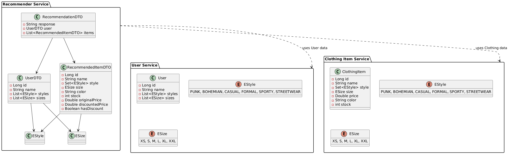

# Recommender Microservices System

En proyecto se ha creado un sistema de recomendación de prendas de ropa, utilizando una arquitectura de **microservicios**. Cada microservicio está enfocado en una responsabilidad específica, y se comunican entre ellos utilizando **Feign Clients** y **Eureka Server**.

[Ver presentación del proyecto](https://www.canva.com/design/DAGo1-UAdHk/5bVdjAWgm_rAXS54QhRuRw/view?utm_content=DAGo1-UAdHk&utm_campaign=designshare&utm_medium=link2&utm_source=uniquelinks&utlId=h26799c08f6)

---

## Estructura del Proyecto

```bash
/clothing-recommendation-system/
│
├── user-service/              # Gestión de usuarios
├── clothing-item-service/     # Gestión de items de ropa
├── recommender-service/       # Generación de recomendaciones personalizadas y otros
├── gateway/                   # API Gateway para unificar accesos
└── discovery-server/          # Eureka Server para descubrimiento de servicios
```


## Tecnologías y Herramientas

- **Java + Spring Boot**
- **Spring Cloud Netflix** (Eureka, Feign)
- **Spring Data JPA**
- **REST APIs**
- **MySQL** (opcional según configuración)
- **Maven**

---

## Microservicios

###  user-service
Servicio encargado de gestionar la información de los usuarios.

- Crear, actualizar, eliminar y obtener usuarios.
- Almacena preferencias de estilo.
- Guarda tallas del usuario.
- Proporciona datos al `recommender-service`.

---

### clothing-item-service
Servicio encargado de la gestión de ítems de ropa.

- Crear, actualizar, eliminar y obtener prendas.
- Consultar prendas por:
  - Estilo
  - Talla
  - Color
  - Precio máximo
- Identifica ítems con exceso de stock.
- Permite aplicar descuentos a productos con sobreinventario.
---

###  recommender-service
Servicio que genera recomendaciones personalizadas para los usuarios.

- Obtener usuarios desde user-service.
- Obtener prendas desde clothing-item-service.
- Combinar las preferencias del usuario con las características de las prendas para generar una lista de recomendaciones con ofertas.
- Expone endpoints para ver recomendaciones por usuario y prendas rebajadas.
---
###  gateway
API Gateway que sirve como punto único de entrada para todos los servicios.

- Redirecciona las solicitudes a los microservicios correspondientes.
- Permite configuración de rutas y políticas de seguridad centralizadas.
---
### discovery-server
Servidor Eureka para descubrimiento de servicios.

- Permite que los microservicios se registren y descubran dinámicamente.
- Facilita la escalabilidad y balanceo de carga.


---

## Comunicación entre servicios

- Se utiliza **Eureka** como sistema de descubrimiento de servicios.
- Los microservicios se comunican mediante **Feign Clients** facilitando llamadas REST internas.

---

## Casos de uso

- 🔍 Buscar usuarios por ID o nombre.
- 🔍 Buscar ítems por estilo, género, talla, etc.
- 🎯 Generar recomendaciones personalizadas de ropa para un usuario.
- 📉 Detectar ítems con exceso de stock y aplicar descuentos automáticamente.

## Ejecución y pruebas
#Requisitos
- Java 17+
- Maven

## Respuesta del endpoint `api/items/filtered/{userId}`

Este endpoint genera una lista personalizada de prendas recomendadas para un usuario específico, combinando sus preferencias con las características de los ítems disponibles.

También permite **filtrar resultados adicionales** mediante parámetros de consulta (query params), como máximo precio o color.

###  Ejemplo de llamada

```http
GET /api/items/filtered/1?maxPrice=20&color=green
```
### 📦 Ejemplo de respuesta

```json
{
  "response": "Recomendación generada exitosamente",
  "user": {
      
{
      "id": 123,
      "name": "Name",
      "style": ["PUNK", "STREETWEAR"],
      "size": ["M","L"]
  },
  "items": [
    {
      "id": 123,
      "name": "Camiseta básica blanca",
      "style": ["CASUAL", "STREETWEAR"],
      "size": "M",
      "color": "Green",
      "stock": 50,
      "originalPrice": 19.99,
      "discountedPrice": 14.99,
      "hasDiscount": true
    }
  ]
}

```


## Diagramas

A continuación se muestran los esquemas generales del sistema:

- **Modelo de datos**: relaciones entre entidades principales (usuarios, ítems, recomendaciones).
- **Arquitectura general**: interacción entre microservicios, gateway y discovery server.



---

##  Endpoints importantes

> ⚠️ Reemplaza `localhost` con el puerto real del Gateway (`gateway-service`) una vez desplegado.

| Servicio               | Endpoint                                         | Descripción                                                   |
|------------------------|--------------------------------------------------|---------------------------------------------------------------|
| `user-service`         | `/api/user/{id}`                                 | Obtener usuario por ID                                        |
| `item-service`         | `/api/item/{id}`                                 | Obtener ítem de ropa por ID                                   |
| `item-service`         | `/api/clothing-item/search?name=kilt`           | Buscar ítems por nombre                                       |
| `item-service`         | `/api/items/excess-stock`                       | Obtener ítems con exceso de stock                             |
| `item-service`         | `/api/items/discount`                           | Obtener ítems con descuento aplicado                          |
| `recommender-service`  | `/api/items/filtered/{userId}`                  | Recomendaciones personalizadas para un usuario                |
| `recommender-service`  | `/api/items/filtered/{userId}?maxPrice=90&color=green` | Recomendaciones con filtros por precio y color        |

---

##  Futuras mejoras

- Extraer enums (como `EStyle`, `ESize`) a una **librería compartida** entre microservicios
-  Permitir búsqueda más flexible en parámetros (`color=gren` → `green`)
-  Implementar `JpaSpecificationExecutor` en `clothing-item-service` para búsquedas más potentes y combinadas

